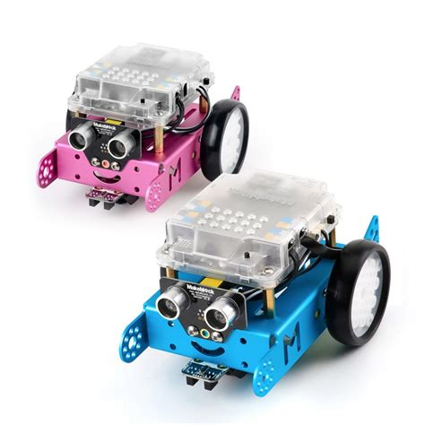
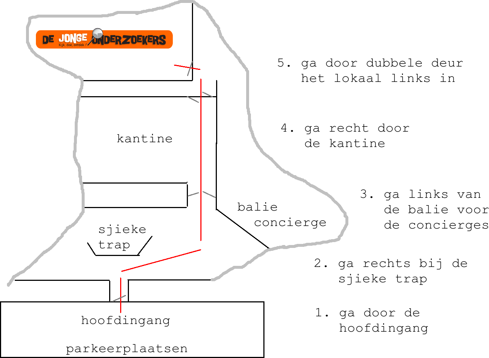

# Damster Dojo

mBot                                                               |Arduino
-------------------------------------------------------------------|-----------------------------------------------------------------------
|

Dit is de website van de Damster Dojo. De Damster Dojo is een 
programmeer- en digitale electronicacursus in Appingedam, gegeven vanuit
[De Jonge Onderzoekers Groningen](https://www.djog.nl).

De jongere leerlingen beginnen met mBot, de oudere leerlingen met Arduino.

## :warning: Tijdelijk lessen via Discord :warning: 

In deze dagen gaan veel dingen even niet door. Met De Jonge Onderzoekers
proberen we iets leuks te blijven doen :+1:

Komende tijd ben je welkom om op Discord mee te doen met de lessen. 
Maak Richel je Discord vriend: `richelbilderbeek#9002`,
dan voegt hij je toe aan het De Jonge Onderzoekers kanaal.

Het wordt even wennen, maar samen maken we er vast iets leuks en leerzaams van!
Logisch, Richel is erbij :sunglasses: !

Deze video's laten we zien hoe wij werken:

 * Hoe gedragen wij ons op Discord: [YouTube](https://youtu.be/8unOiXlDYqM) [download (.OGG)](http://richelbilderbeek.nl/damster_dojo_discord_gedrag.ogv)
 * Onze eerste les op Discord: [YouTube](https://youtu.be/TQ8myDdix8U) [download (.OGG)](http://richelbilderbeek.nl/damster_dojo_discord_20200315.ogv)

## Agenda

 * Zaterdag 14 maart: Pi Dag: om 00:03:14 (pi minuten na middernacht) op bushalte P van CS Groningen, zie [hier](https://github.com/richelbilderbeek/pi_day)
 * ~~Zaterdag 14 maart: [DoeDigiDag](https://noordendigitaal.nl/activiteiten/kom-langs-bij-de-jonge-onderzoekers-en-leer-zelf-programmeren), 11:00-17:00 @ Forum, Nieuwe Markt 1, Groningen~~ Gaat niet meer door, wegens een niet-computer virus
 * Maandag 16 maart: geen les op locatie, maar wel via Discord :godmode:
 * Maandag 23 maart: geen les op locatie, maar wel via Discord :godmode:
 * Maandag 30 maart: misschien weer les op locatie, dat is even afwachten ...
 * Maandag 13 apr: Geen les, wegens 2e paasdag
 * Maandag 27 apr: Geen les, wegens meivakantie
 * Maandag 04 mei: Geen les, wegens dodenherdenking
 * Maandag 01 jun: Geen les, wegens 2e Pinksterdag
 * Maandag 22 jun: Eindpresentaties + evaluaties
 * Maandag 29 jun: Laatste les voor de zomervakantie

### Over de cursus

 * Wat: cursus [mBot](https://github.com/richelbilderbeek/mbot_voor_jonge_tieners)
   en [Arduino](https://github.com/richelbilderbeek/arduino_voor_jonge_tieners)
 * Leeftijd: 8-18 jaar
 * Hoe laat: 

Wat         | Tijd
------------|------
Inloop      | 18:00
Start les   | 18:15
Pauze les   | 19:00
Vervolg les | 19:15
Einde les   | 20:00

 * Waar: Technieklokaal Noorderpoortcollege, Opwierderweg 2, Appingedam
 * Kosten: 27,50 
 * Meenemen: Arduino/mBot (als je die hebt), laptop (als je die hebt), 
   electronica (als je dat hebt), USB stick (als je je mee wilt nemen)
 * Wanneer instromen: altijd!

Hier een slordige kaart:

Heb je nog een vraag? Kijk [bij de veelgestelde vragen](doc/veelgestelde_vragen.md)

## [Lesplanning](doc/lesplanning.md)

Zie [lesplanning](doc/lesplanning.md)

## Dingen

Branch|
---|---
`master`|

## Links

 * [DJOG GitLab](http://51.15.53.32)
 * [DJOG Discord](https://discord.gg/XYBXfE)
 * [mBot lessen](https://github.com/richelbilderbeek/mbot_voor_jonge_tieners/tree/master/hoofdstukken)
 * [mBot boeken](https://github.com/richelbilderbeek/mbot_voor_jonge_tieners/tree/master/boeken)
 * [Arduino lessen](https://github.com/richelbilderbeek/arduino_voor_jonge_tieners/tree/master/hoofdstukken)
 * [Arduino boeken](https://github.com/richelbilderbeek/arduino_voor_jonge_tieners/tree/master/boeken)
 * [Lesmateriaal LEGO](https://education.lego.com/nl-nl)

## Video's

 * Hoe gedragen wij ons op Discord: [YouTube](https://youtu.be/8unOiXlDYqM) [download (.OGG)](http://richelbilderbeek.nl/damster_dojo_discord_gedrag.ogv)
 * Onze eerste les op Discord: [YouTube](https://youtu.be/TQ8myDdix8U) [download (.OGG)](http://richelbilderbeek.nl/damster_dojo_discord_20200315.ogv)

