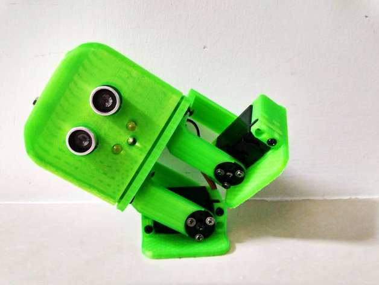
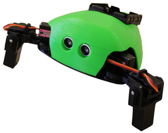
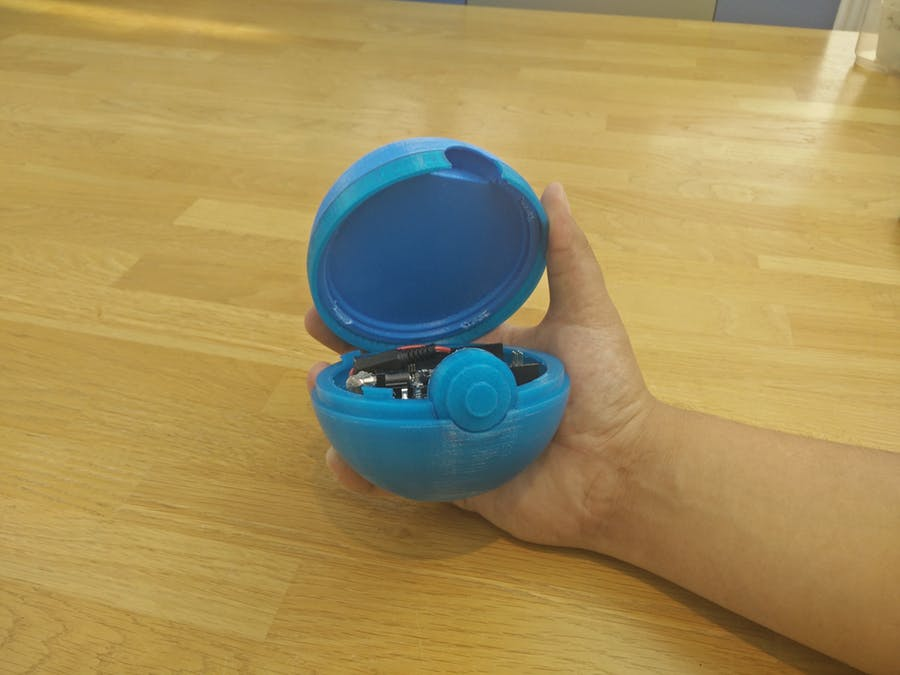
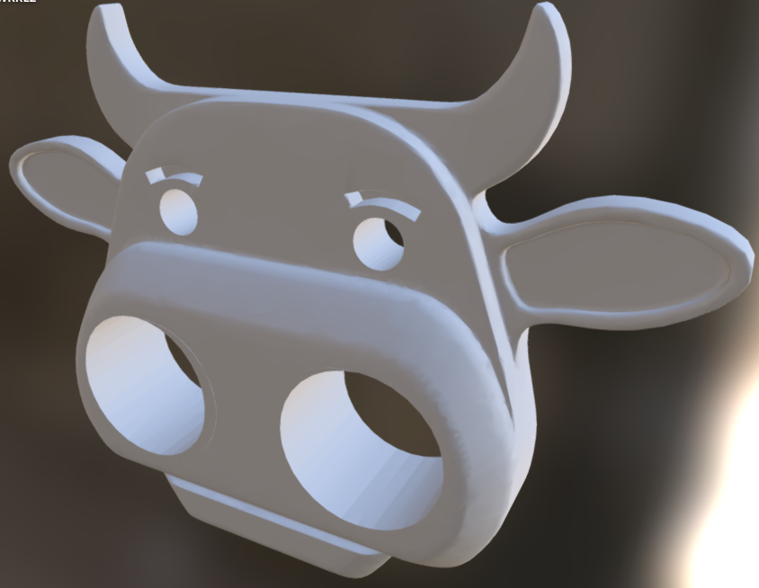
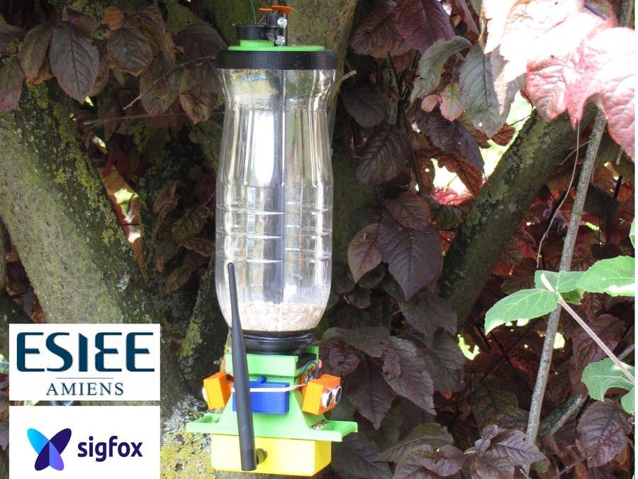

# 3D modellen

 * [Arduino project](https://create.arduino.cc/projecthub/projects/tags/3d+printing)

## Tito robot

 * [Arduino project](https://create.arduino.cc/projecthub/cparrapa/tito-arduino-uno-3d-printed-robot-9f7777?ref=tag&ref_id=3d%20printing&offset=4)
 * [Thingyverse](https://www.thingiverse.com/thing:1378605)

## Critter

 * [Arduino project](https://create.arduino.cc/projecthub/slantconcepts/critter-crawling-arduino-robot-123670?ref=tag&ref_id=3d%20printing&offset=5)
 * [littlearmrobot.com](https://www.littlearmrobot.com/store/p35/critter_files.html)

## Pokebal

 * [Arduino project](https://create.arduino.cc/projecthub/MarJoh/arduino-pokeball-5555d8?ref=tag&ref_id=3d%20printing&offset=10)

## Radar

 * [Arduino project](https://create.arduino.cc/projecthub/MakerRobotics/arduino-radar-version-2-0-24371e?ref=tag&ref_id=3d%20printing&offset=14)

## Bird feeder

 * [Arduino project](https://create.arduino.cc/projecthub/esiee-amiens-students/smart-bird-feeder-a75e3b?ref=tag&ref_id=3d%20printing&offset=13)

