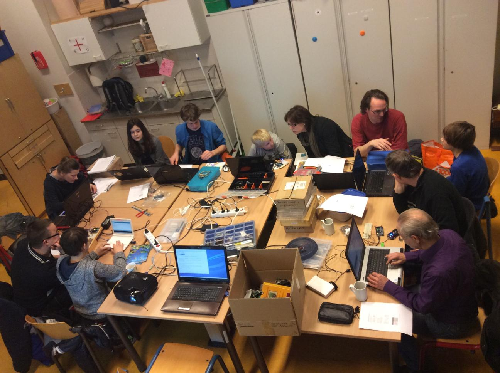
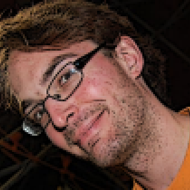

# Veelgestelde vragen

Dit zijn de veelgestelde vragen.

## Hoe ziet de cursus eruit?

Dat weten we nog niet.

Wel weten we hoe dezelfde cursus in Groningen eruit zag in het begin:

## Ik ben jonger dan acht jaar oud, ben ik welkom?

Ja. We zien wel dat leerlingen veel jonger dan 8 jaar oud 
electronica en programmeren erg moeilijk vinden. 
Maar je mag het altijd komen proberen.

## Ik ben ouder dan 18 jaar oud, ben ik welkom?

Ja. Nieuwe volwassenen zullen door de jongeren opgeleid worden (van 18:15-20:00). 
Dit is het meest leerzaam voor de *jongeren*. 
Voel je dus vooral welkom. 
Volwassenen zal daarna vriendelijk gevraagd worden om minstens een van de volgende dingen te gaan doen:

  1. gave dingen te bouwen om de leerlingen te inspireren 
  2. assisteren bij de lessen door de leerlingen met hun vragen te helpen
  3. lessen te geven

Hierbij geldt de regel is dat de kinderen altijd voor gaan. 

## Ik heb geen [...]. Is dat erg?

Nee, wij hebben wel reserve laptops, Arduino's, electronica, etc.

We zien wel dat het handiger voor de leerlingen is een eigen laptop te hebben. 
Ook merken we dat leerlingen na zes lessen hun ouders gaan vragen 
om een Arduino om thuis mee te werken. 

## Mag ik games maken?

Jazeker! Sterker nog, het programmeren van games is een van de leukste 
manieren om electronica en programmeren te leren.

## Mag ik gamen?

Nee. Gamen vinden we nooit goed: niet tijdens de les, niet voor de les, 
niet in de pauze, niet na de pauze.
De maandagavond is een cursus avond, waarbij leren voorop staat. 
Gamen draagt niet bij aan het leren programmeren. 

Heb je *zelf* een spel geprogrammeerd, dan krijg je de ruimte om het spel 
te laten zien en te laten testen. 

## Welke vrijwilligers zijn er?

### [Richel](https://github.com/richelbilderbeek)

Richel programmeert sinds zijn achtste. Hij is de meest ervaren en belezen 
programmeur, vooral in C++ en R. Richel is vooral geinteresseerd in onderwijs 
en heeft de lerarenopleiding aan de universiteit afgerond.
Zijn werk is te zien op [zijn website met meer dan 3900 pagina's](http://richelbilderbeek.nl) 
en [meer dan 900 GitHub repositories](https://github.com/richelbilderbeek?tab=repositories).

Richel is eindverantwoordelijk voor de cursus. 

## Hoe kan het dat de cursus zo goedkoop is?

Omdat we enkel met vrijwilligers werken.

## Kan zo een goedkope cursus wel goed zijn?

Volgens de leerlingen in Groningen wel,
waar we gemidddeld 9 op 10 scoren [1].
Zie [hier](https://github.com/richelbilderbeek/ArduinoCourse/blob/master/Evaluatie/README.md) 
de evaluaties.

 * [1] :warning: de statistici zien hier terecht een 'sampling bias':
   de evaluaties worden enkel gedaan met de leerlingen die blijven. Dit zijn
   wellicht de tevreden leerlingen

## Wat is de missie van de cursus?

De missie van De Jonge Onderzoekers is: 

> '[Het] exploiteren van een activiteitencentrum 
> met als doel kinderen op een uitdagende en creatieve manier 
> met techniek en wetenschap in aanraking te laten komen'. 

De missie van Damster Dojo heeft veel overlap hiermee. 
We vinden het belangrijk dat de kinderen iets leren, 
uitgedaagd worden en hun creativiteit gebruiken om iets te maken. 
Leerlingen krijgen kort uitleg, werken in het begin een boek door, 
maar worden ook gestimuleerd elkaar te helpen, zelf les te geven en mee te beslissen.
